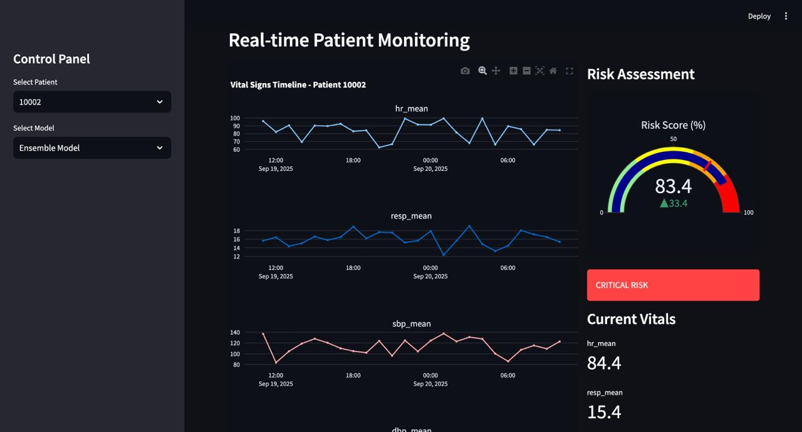
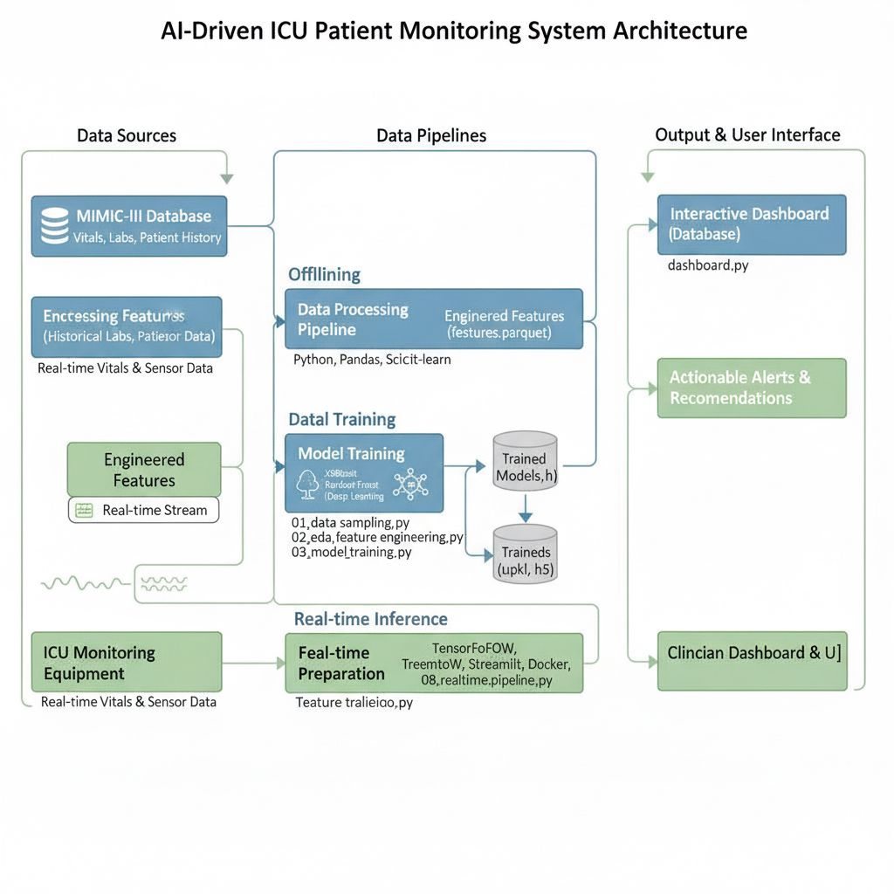
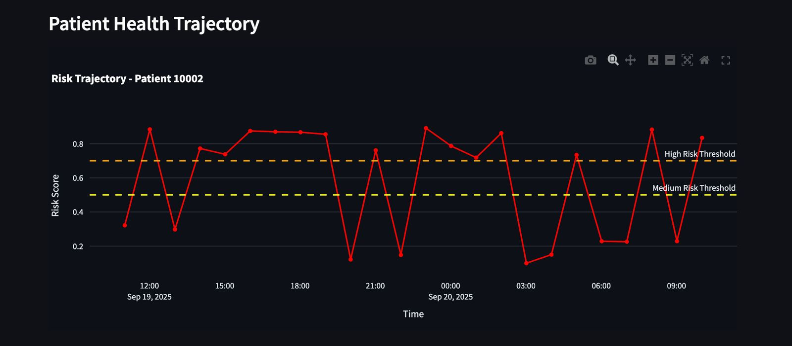
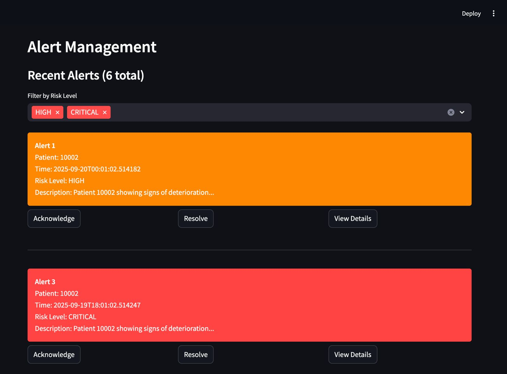
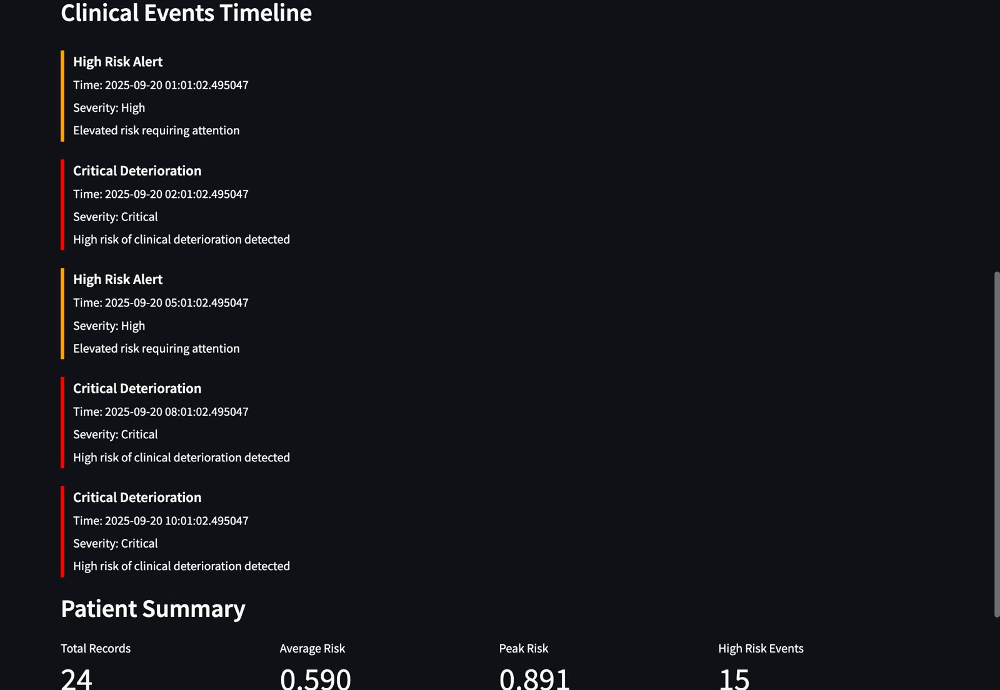
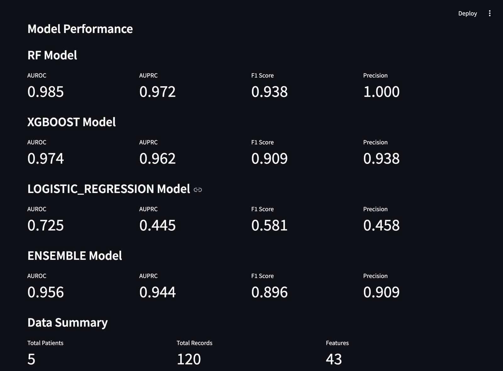

# Foresight-ICU: A Clinical Deterioration & Explainable AI (XAI) Engine

**Foresight-ICU** is a high-fidelity clinical decision support system (CDSS) that predicts patient deterioration in Intensive Care Units. By processing high-frequency physiological data from the MIMIC-III database, the system identifies subtle patterns of instability—such as sepsis or respiratory failure—hours before they become clinically overt.

---

## 🚀 Project Overview

This project implements an end-to-end machine learning pipeline to transform raw ICU data into actionable clinical intelligence. It features robust feature engineering, ensemble modeling, and a sophisticated alert system designed for real-world clinical environments.

### 1. Data Ingestion & Sampling Strategy
To handle the high-dimensional nature of the MIMIC-III dataset, the system utilizes a patient-level sampling approach to maintain demographic distribution while optimizing for computational performance.

---

## 🏗️ Technical Deep Dive

### Foresight-ICU: A Clinical Deterioration & Explainable AI (XAI) Engine
Foresight-ICU is a high-fidelity clinical decision support system (CDSS) that predicts patient deterioration in Intensive Care Units. By processing high-frequency physiological data from the MIMIC-III database, the system identifies subtle patterns of instability—such as sepsis or respiratory failure—hours before they become clinically overt.

### 2. Clinical Feature Engineering
The engine derives critical physiological markers including:
* **Shock Index ($HR / SBP$):** A key indicator of occult shock.
* **Mean Arterial Pressure (MAP):** Assessing organ perfusion status.
* **Temporal Trends:** Rolling windows that capture the velocity of vital sign changes.

### 3. Predictive Modeling & Imbalance Handling
The system addresses medical data imbalance using:
* **Aggressive Class Weighting:** Prioritizing sensitivity to ensure critical events are not missed.
* **Threshold Optimization:** Dynamically calculating the optimal F1 threshold for ensemble models (XGBoost, Random Forest, Logistic Regression).

### 4. Robust Explainable AI (XAI)
Clinician trust is built through **SHAP**-based explanations:
* **Fidelity Testing:** Validating that model accuracy is tied to clinically relevant features.
* **Waterfall Visualizations:** Providing patient-specific risk factor breakdowns.

### 5. Intelligent Alerting & Risk Stratification
Designed to combat **Alert Fatigue**, the system features:
* **Risk Tiers:** Stratification into Low, Medium, High, and Critical levels.
* **Cooldown Protocols:** Preventing redundant alerts for stable abnormal vitals.

---

## 📈 Evaluation & Results
The models are evaluated on AUROC, F1-Score, and calibration reliability to ensure predictions translate accurately to clinical risk.

---

## 🛠️ Tech Stack
* **Core:** Python (Scikit-learn, XGBoost, Pandas)
* **XAI:** SHAP (Shapley Additive Explanations)
* **Real-time:** Asyncio for vital stream simulation
* **Database:** MIMIC-III Clinical Database
